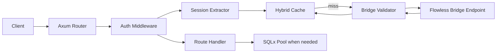

# Architecture

## Request Flow

## Core Modules

- `config`: typed environment settings, defaults, and production validation.
- `auth`: session types, validation modes, Bridge validation, and middleware.
- `cache`: local TTL cache plus optional Redis connection manager.
- `db`: SQLx `AnyPool` setup and health checks.
- `routes`: public, protected, optional, profile, admin, health, and mock task endpoints.
- `tokens`: PASETO v4.public trust tokens for starter flows.

## Security Model

The application does not trust a client-provided session ID by itself. Protected routes call the Flowless Bridge validation endpoint using the configured bridge secret. Valid sessions are cached for a short TTL to reduce repeated validation calls.

Admin routes are two-step protected:

1. `require_auth` validates the session and inserts `SessionData`.
2. `require_admin()` checks `user_type` for `admin` only. Custom routes can use `require_roles(["role"])` or `require_roles_csv("role,other")`.

## Database Model

SQLx is included for pool management and health checks. The starter does not force a task schema. Mock task routes show route structure only.
